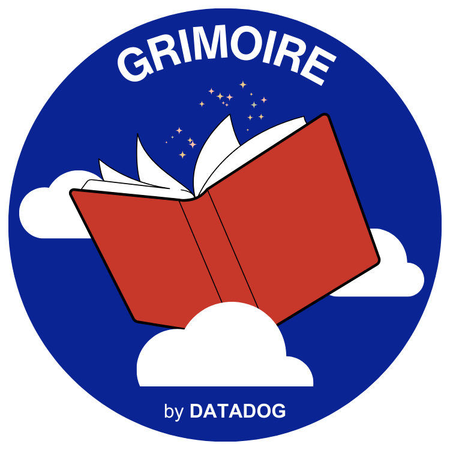
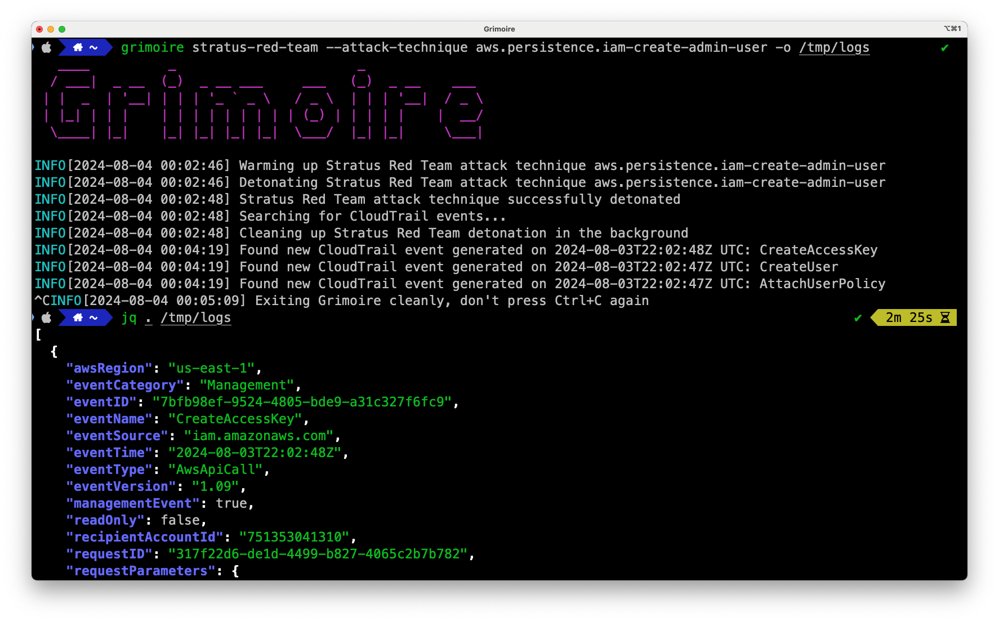

# Grimoire

<p align="center">
  
</p>

Grimoire is a "REPL for detection engineering" that allows you to generate datasets of cloud audit logs for common attack techniques. It currently supports AWS.

<p align="center">
  <a href="https://github.com/DataDog/grimoire/raw/main/stratus-red-team.png">
    
  </a>
</p>


<p align="center">
  <a href="https://github.com/DataDog/grimoire/raw/main/shell.png">
    
  </a>
</p>

## How it works

First, Grimoire detonates an attack. It injects a unique user agent containing a UUID. Then, it polls CloudTrail to retrieve the audit logs caused by the detonation, and streams the resulting logs to an output file or to your terminal.

Supported detonators:
- [Stratus Red Team](https://github.com/DataDog/stratus-red-team)
- AWS CLI interactive shell

Supported logs backend:
- AWS CloudTrail (through the `LookupEvents` API)

## Installation

### Direct install

Requires Go 1.22+

```bash
go install -v github.com/datadog/grimoire/cmd/grimoire@latest
```

### Homebrew

```bash
brew tap datadog/grimoire https://github.com/DataDog/grimoire
brew install datadog/grimoire/grimoire
```

### Pre-built binaries

Download one of the pre-built binaries from the [releases page](https://github.com/DataDog/grimoire/releases).
## Getting started

Make sure you're [authenticated against AWS](https://docs.aws.amazon.com/signin/latest/userguide/command-line-sign-in.html) and have `AWS_REGION` set before running Grimoire:

```
export AWS_REGION=us-east-1
```

## Usage

Grimoire has two main commands: 
- [`grimoire stratus-red-team`](#detonate-an-attack-technique-with-stratus-red-team)
- [`grimoire shell`](#detonate-an-attack-manually-in-an-interactive-shell)

### Detonate an attack technique with [Stratus Red Team](https://github.com/DataDog/stratus-red-team):

```bash
$ grimoire stratus-red-team -o /tmp/logs --attack-technique aws.credential-access.ssm-retrieve-securestring-parameters
INFO[0000] Warming up Stratus Red Team attack technique aws.credential-access.ssm-retrieve-securestring-parameters
INFO[0000] Detonating Stratus Red Team attack technique aws.credential-access.ssm-retrieve-securestring-parameters
INFO[0003] Stratus Red Team attack technique successfully detonated
INFO[0003] Searching for CloudTrail events...
INFO[0009] Found new CloudTrail event generated on 2024-07-30T20:58:43Z UTC: DescribeParameters
INFO[0009] Found new CloudTrail event generated on 2024-07-30T20:58:42Z UTC: DescribeParameters
```

In another terminal, you can tail `/tmp/logs` to see the logs as they're discovered in CloudTrail. Alternatively, you can use `-o -` to print the logs in your terminal as they are found. You can safely use Ctrl+C to exit.

Keep in mind that some Stratus Red Team attack techniques may take some time to complete. These are marked with a `Slow` badge on their documentation page, such as [Steal EC2 Instance Credentials](https://stratus-red-team.cloud/attack-techniques/AWS/aws.credential-access.ec2-steal-instance-credentials/).

### Detonate an attack manually in an interactive shell

You can also detonate an attack manually in an interactive shell. In that case, Grimoire will spin up a new $SHELL for you, and inject the `AWS_EXECUTION_ENV` environment variable to ensure that the AWS CLI commands you run generate logs that Grimoire captures.

```bash
$ grimoire shell -o /tmp/logs
INFO[0000] Grimoire will now run your shell and automatically inject a unique identifier to your HTTP user agent when using the AWS CLI
INFO[0000] You can use the AWS CLI as usual. Press Ctrl+D or type 'exit' to return to Grimoire.
INFO[0000] When you exit the shell, Grimoire will look for the CloudTrail events that your commands have generated.
INFO[0000] Press ENTER to continue

# We're now in a "Grimoire-instrumented" shell
$ aws sts get-caller-identity
$ aws ec2 describe-instances
$ exit
INFO[0040] Welcome back to Grimoire!
INFO[0040] Searching for CloudTrail events...
INFO[0090] Found event: DescribeInstances
INFO[0090] Found event: GetCallerIdentity
```

In the shell that Grimoire spawns, you can use the `$GRIMOIRE_DETONATION_ID` environment variable if you eed to propagate the user agent to other tools. For instance:

```
$ grimoire shell -o /tmp/logs
$ awscurl -H "User-Agent: $GRIMOIRE_DETONATION_ID" --service ec2 \
    'https://ec2.amazonaws.com?Action=DescribeRegions&Version=2013-10-15'
```

... will allow Grimoire to identify CloudTrail events generated by `awscurl` as well.

### Detonate an attack manually by specifying commands

You can use `grimoire shell` in non-interactive mode, passing it a command or a script to run instead:

```
$ grimoire shell --command 'aws sts get-caller-identity'
INFO[0000] Running detonation command: aws sts get-caller-identity
{
    "UserId": "AIDAEXAMPLE",
    "Account": "012345678901",
    "Arn": "arn:aws:iam::012345678901:user/christophe"
}
INFO[0002] Searching for CloudTrail events...
INFO[0140] Found event: GetCallerIdentity
```

Using a script:

```
$ cat /tmp/script.sh
aws sts get-caller-identity
aws iam create-user --user-name foobar
aws iam create-access-key --user-name foobar

$ grimoire shell --script /tmp/script.sh
INFO[0000] Running detonation script: /tmp/script.sh
+/tmp/script.sh:1> aws sts get-caller-identity
+/tmp/script.sh:2> aws iam create-user --user-name foobar
+/tmp/script.sh:3> aws iam create-access-key --user-name foobar
INFO[0005] Searching for CloudTrail events...
```

### Advanced usage

You can use `--timeout`, `--max-events`, `--include-events`, `--exclude-events` and `--only-write-events` to control how long Grimoire should poll CloudTrail, how many events to retrieve, and which events to include or exclude.

```bash
# Wait for a single sts:GetCallerIdentity event and exit
grimoire shell --command 'aws sts get-caller-identity' --include-events 'sts:GetCallerIdentity' --max-events 1

# Only keep iam:* events and exit after 5 minutes or 2 events (whichever comes first)
grimoire stratus-red-team --attack-technique aws.persistence.iam-create-admin-user --include-events 'iam:*' --max-events 2 --timeout 3m

# Only keep IAM write events
grimoire shell --script /tmp/attack.sh --include-events 'iam:*' --only-write-events

# Exclude sts:AssumeRole events
grimoire shell --script /tmp/attack.sh --exclude-events 'sts:GetCallerIdentity'

# Wait for at least one IAM or EC2 write event and exit. Fail if the logs aren't available within 10 minutes.
grimoire shell --script /tmp/attack.sh --only-write-events --include-events 'iam:*,ec2:*' --max-events 1 --timeout 10m
```
## Development

Running locally:

```bash
alias grimoire='go run cmd/grimoire/*.go'
grimoire --help
```

Use `--debug` for verbose logging.

Building binaries:

```bash
make
```

Running the tests:

```bash
make test
```

## Disclaimer

When detonating attacks with Stratus Red Team, it's best to avoid interrupting execution with Ctrl+C while the technique is being detonated. While we take a great deal of care to clean up after ourselves, it may happen that some resources are left behind, specifically because the [terraform-exec](https://github.com/hashicorp/terraform-exec) wrapper used by Stratus Red Team panics on Ctrl+c and doesn't offer an option to exit cleanly.

## FAQ

### Why are CloudTrail events slow to arrive?

Delivery of CloudTrail events can take up to 15 minutes. If you don't see events immediately, wait a few minutes and try again. In the majority of cases, though, it's expected that CloudTrail events are made available within 5 minutes.

For more information, see the [AWS documentation](https://docs.aws.amazon.com/awscloudtrail/latest/userguide/get-and-view-cloudtrail-log-files.html) and [How fast is CloudTrail today?](https://tracebit.com/blog/how-fast-is-cloudtrail-today-investigating-cloudtrail-delays-using-athena).

### Why isn't Grimoire part of Stratus Red Team?

We chose to separate Grimoire from Stratus Red Team because we feel that Grimoire should support other ways of detonating attack techniques. 

That said, Stratus Red Team has a dedicated section `Detonation logs` for every AWS attack technique. These logs have been generated using Grimoire and can be used to validate the detection rules you've written.

### What about CloudTrail Data Events?

Data events are not supported for now. If you're interested, please upvote [this issue](https://github.com/DataDog/grimoire/issues/1).
